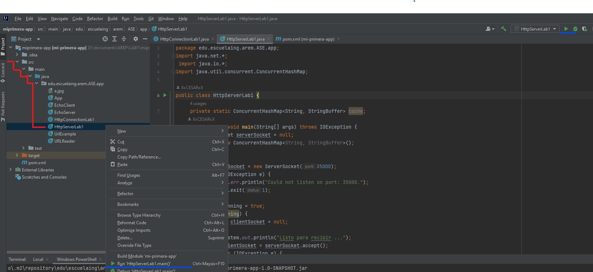
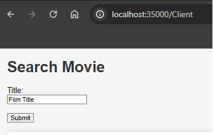
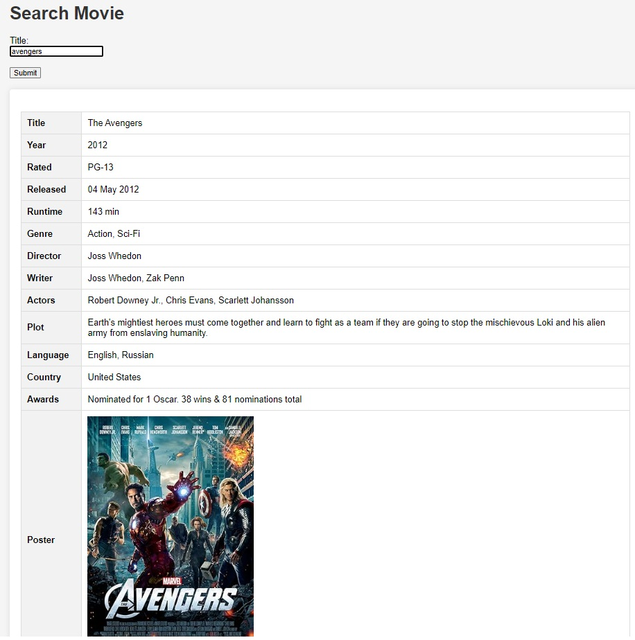

s# TALLER 1: APLICACIONES DISTRIBUIDAS (HTTP, SOCKETS, HTML, JS,MAVEN, GIT)
Se desarrolará una aplicación eficiente y multiusuario que utiliza la API gratuita de " https://www.omdbapi.com/ " para consultar información de películas. La arquitectura incluye un cliente web asíncrono en el navegador, un servidor que actúa como gateway y una fachada de servicios con caché para evitar consultas repetidas al API. El proyecto se gestiona con Maven, Git y GitHub. El backend está desarrollado exclusivamente en Java, sin utilizar frameworks como SPRING. La interfaz web, implementada en HTML y JS, es simple y no depende de librerías complejas.

## Requisitos previos
Asegúrate de tener las siguientes herramientas y dependencias instaladas antes de configurar el proyecto
#### Maven
Instala Maven, una herramienta de gestión de proyectos para Java. Puedes descargarlo desde el sitio web oficial https://maven.apache.org/install.html
#### Java Development Kit (JDK) 17
Asegúrate de tener instalado JDK 17 en tu máquina. Puedes descargarlo desde la página oficial de OpenJDK.

nota: si por algun motivo el projecto no lo puede ejecutar, prube agregando la siguiente propiedad (antes de las dependencias) en el pom:
~~~
<properties>
<maven.compiler.source>1.8</maven.compiler.source>
<maven.compiler.target>1.8</maven.compiler.target>
</properties>
~~~

## Empezar
Sigue estos pasos para configurar el proyecto en tu máquina local y comenzar a trabajar:

#### Clonar el Repositorio:
Utiliza el siguiente comando para clonar el repositorio desde GitHub:
~~~
git clone https://github.com/XxELIngexX/Lab1.git
~~~

#### Instalar Dependencias con Maven:
Navega al directorio del proyecto y ejecuta el siguiente comando para instalar las dependencias utilizando Maven:
~~~
mvn clean install
~~~

#### Compilar el Proyecto:
Una vez que las dependencias estén instaladas, compila el proyecto con el siguiente comando:
~~~
mvn compile
~~~

#### Ejecutar el Proyecto:
Ejecuta el proyecto con el siguiente comando:
~~~
(por confirmar)
~~~
+ ### ejecutarla desde un IDE:
ára ejecutar desde el IDE puede usar el de su preferencia, entrara en el directorio:
~~~
src/main/java/edu.escuelaing.arem.ASE.app
~~~
y ejecuta la MainClass "HttpServerLab1"

en rojo encontramos el directorio, y en azul las posibles formas de ejecutar el projecto. 
tienes dos opciones para ejecutar:
- darle click izquierdo en la clase HttpServerLab1 y en la opcion "run"
- en la parte superior derecha encontraras un icono de "play", puedes darle click

+ ### Acceder a la Aplicación Localmente:
Abre tu navegador web y accede a la aplicación localmente usando la URL 
~~~
http://localhost:35000/Client
~~~

cuando se acceda al link encontraremos esta interface:

para hacer uso del buscador solo se requiere que se brinde el titulo de la pelicula que desea consultar y puede darle click al boton "submit" o precionar la tecla "INTRO"

## AUTOR
+ Cesar David Amaya Gomez

